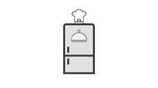

<p align="center">
  <a href="https://github.com/lorenzowind/UBEMath">
    
  </a>

  <h3 align="center">FoodFast</h3>

  <p align="center">
    Application for automation of the query of recipes!
    <br />
    <a href="https://app.swaggerhub.com/apis/lorenzomart/FoodFast/1.0.0"><strong>Explore the API Spec »</strong></a>
    <br />
    <br />
    <a href="https://drive.google.com/file/d/1FJsNBRTJWbB021RdT3WTdYrKnd-IArTM/view?usp=sharing">Download now</a>
    ·
    <a href="https://github.com/lorenzowind/FoodFast/issues/new">Reporte bug</a>
    ·
    <a href="https://github.com/lorenzowind/FoodFast/issues/new">Request Feature</a>
  </p>
</p>

## Table of Contents
* [About the Project](#about-the-project)
  * [Justification](#justification)
  * [Features](#features)
* [Target](#target)
* [Team](#Team)
* [How to download?](#how-to-download)
* [How to install?](#how-to-install)
* [Built With](#built-with)
* [Contact](#contact)


## About The Project
- The FoodFast project consists of an Android application to consult and favor recipes.

### Justification
- The project was based on the understanding of a certain difficulty in organizing and having control of the food available in the kitchen.
- And many people do not have the knowledge of a wide variety of recipes and are unaware of the necessary ingredients.
- In addition to the fact that excessive spending on the market is reflected in the large storage of food and waste is generated.

### Features
- Inventory with all the food the user has in the kitchen, divided into several categories.
- Registration of food manually according to several attributes (optional) - quantity, brand, validity, etc.
- Consultation of recipes.
- Publication of recipes.
- Possible and not possible recipes based on the availability of ingredients from the user's inventory.
- User-defined favorite recipes.
- Recipes filtered by categories (favorites, low calorie, vegetarian, etc).

## Target
- People with difficulty organizing food, lack of knowledge in recipes and desire for a healthy eating routine.

## Team
- Lorenzo Windmoller Martins (Developer)
- Samuel Albuquerque de Paiva (Designer)
- Vinícius Andrade Perrone (Developer)

## How to download?
- To download the project, execute the command:
```bash
// Clone the application repository
$ git clone https://github.com/lorenzowind/FoodFast.git
```

## How to install?
1. To run the backend, follow these steps:
- Navigate to the backend folder and install the dependencies:
```bash
// Navigate to the backend folder
$ cd backend

// Install application dependencies
$ yarn
```
- Install MySQL, MongoDB, Redis and Adminer Docker images using docker-compose:
```bash
// Run the Docker images
$ docker-compose up -d
```
- Create a file called .env based on .env.example and enter your AWS credentials;
- Create a file called .ormconfig.json based on .ormconfig.example.json and insert the MySQL and MongoDB host and port according to the previously installed Docker images, in addition to exchanging the src recipient for dist and .ts for .js;
- Configure the credentials of the MySQL Docker image using the following commands:
```bash
// Enter the MySQL image bash
$ docker exec -it IMAGE_NAME bash
// Enter the MySQL image root
$ mysql -u root -p
// Change the password
$ ALTER USER root IDENTIFIED WITH mysql_native_password BY ‘ROOT_USER_PASSWORD’;
```
- Run the database migrations using the command:
```bash
// Run the migrations
$ node_modules/.bin/typeorm migration:run
```
- Add a no-restart configuration for each Docker image using the command:
```bash
// Change the configuration of the Docker images
$ docker update --restart=unless-stopped ID_DA_IMAGEM
```
- Start the server using the command:
```bash
// Start the server
$ yarn dev:server
```
2. To install the application on any device, follow these steps:
- Navigate to the location of the .apk file and open it on the device
```bash
// Navigate to the .apk file
$ cd mobile/app/build/outputs/apk
```
## Built With
- The application's backend was developed using the following technologies:
  - [Node.js](https://nodejs.org/en/)
  - [Express](https://expressjs.com/pt-br/)
  - [MySQL](https://www.mysql.com/)
  - [MongoDB](https://www.mongodb.com/)
  - [Redis](https://redis.io/)
- The application's mobile was developed using the following technologies:
  - [Android](https://www.android.com/intl/pt-BR_br/)
  - [Volley](https://developer.android.com/training/volley)

## Contact
Lorenzo Windmoller Martins - [LinkedIn](https://www.linkedin.com/in/lorenzo-windmoller-martins/) - lorenzomart01@gmail.com

Samuel Albuquerque de Paiva - samycaaa@gmail.com

Vinícius Andrade Perrone - [LinkedIn](https://www.linkedin.com/in/vin%C3%ADcius-perrone-2484001b1/) - perronevinicius2018@gmail.com

## Acknowledgements
* [README Template by othneildrew](https://github.com/othneildrew/Best-README-Template)
* [Img Shields](https://shields.io)

[contributors-shield]: https://img.shields.io/github/contributors/lorenzowind/FoodFast?style=flat-square
[contributors-url]: https://github.com/lorenzowind/FoodFast/graphs/contributors

[issues-shield]: https://img.shields.io/github/issues/lorenzowind/FoodFast?style=flat-square
[issues-url]: https://github.com/lorenzowind/FoodFast/issues

[size-shield]: https://img.shields.io/github/repo-size/lorenzowind/FoodFast?style=flat-square

[commit-shield]: https://img.shields.io/github/last-commit/lorenzowind/FoodFast?style=flat-square
